# Hi There! I'm Egor

## About me
- 🧑🏻‍💻 iOS Developer
- 👨🏻‍🎓 Higher School of Economic Software Engineering student. Studying [github account](https://github.com/zazzazeHSE) 
- 📖 Passionate about studying Kotlin Mutliplatform Mobile

|  |  |
|------------|-------------|
 -----------

  

